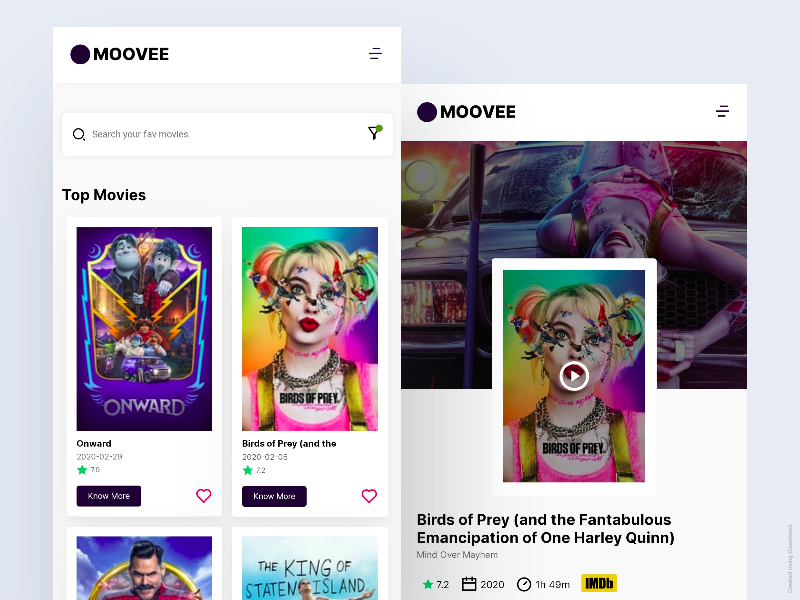
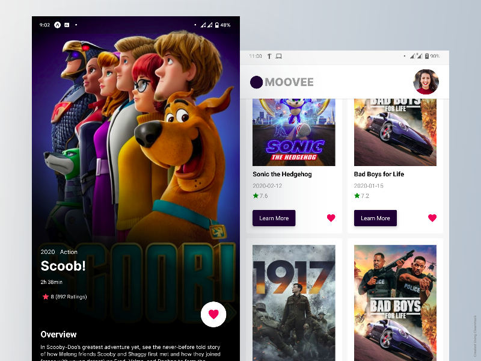
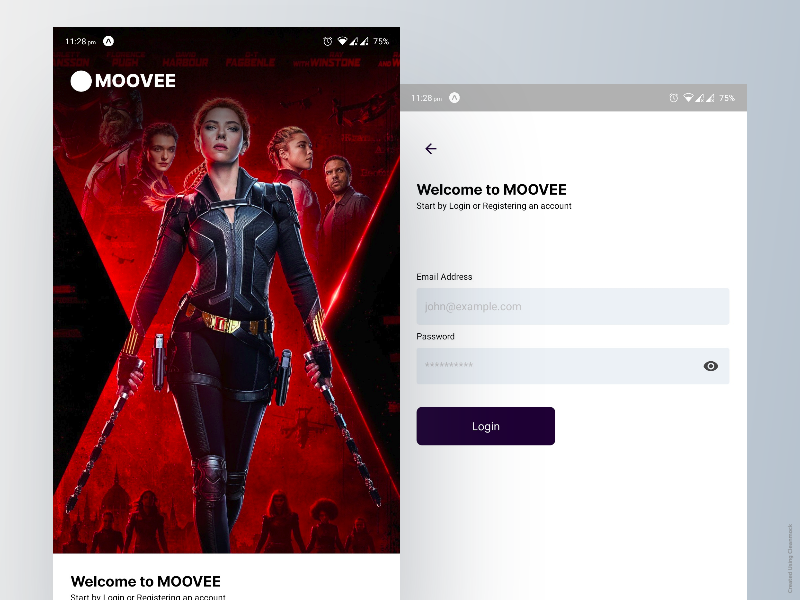
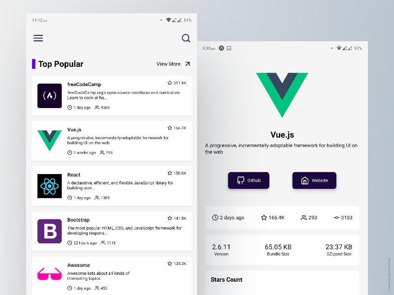
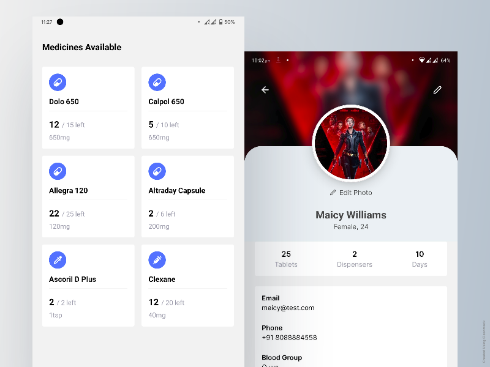
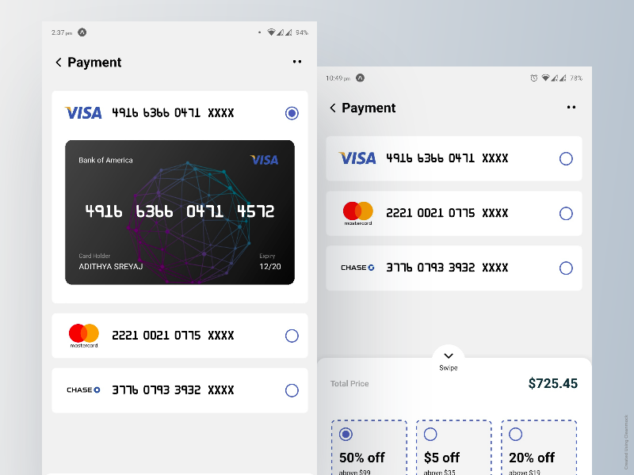

# 100 Days of Code - React

The repository is for tracking the progress of 100 Days of code challenge.
Here are all the applications/components that I have built using React/React Native during the span of 100 Days.

## #1. MOOVEE Web Application

MOOVEE application is basically like IMDB which showcases movies and then its details inside.

- Technology: **React, Redux**
- Repo: https://github.com/adisreyaj/moovee

## #2. MOOVEE Mobile Application

MOOVEE application is basically like IMDB which showcases movies and then its details inside.

- Technology: **ReactNative**
- Repo: https://github.com/adisreyaj/moovee-app

## #3. BestOfJS Mobile App

- Technology: **ReactNative**
- Repo: https://github.com/adisreyaj/moovee-app

## #4. Pillbox Mobile App

- Technology: **ReactNative**
- Repo: https://github.com/adisreyaj/pill-box

## #5. Payments Page

- Technology: **ReactNative**
- Repo: https://github.com/adisreyaj/react-native-examples
